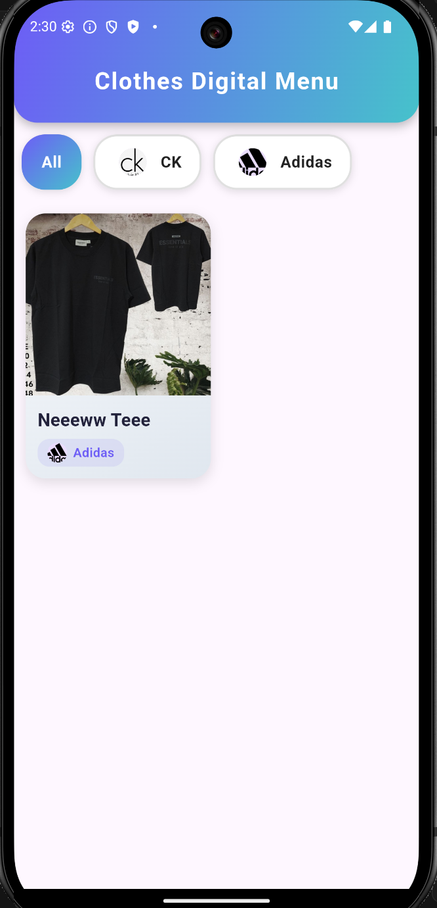
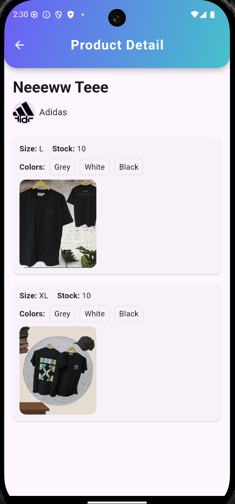
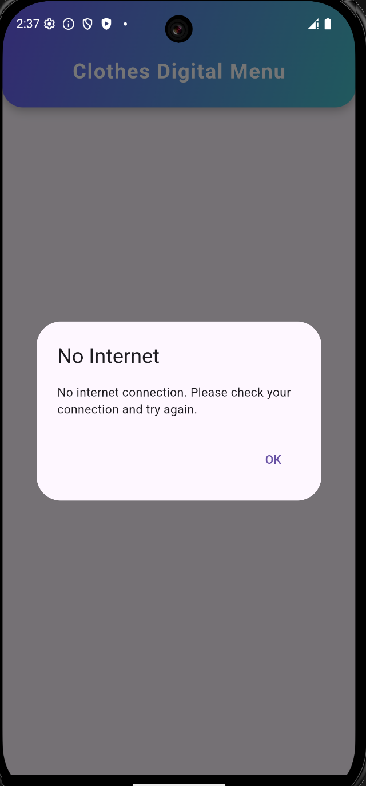
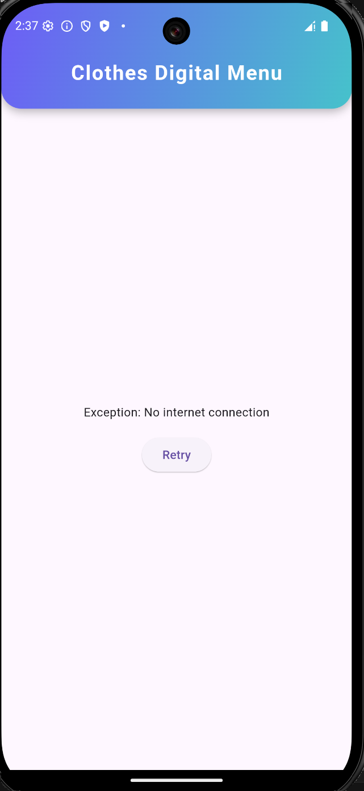
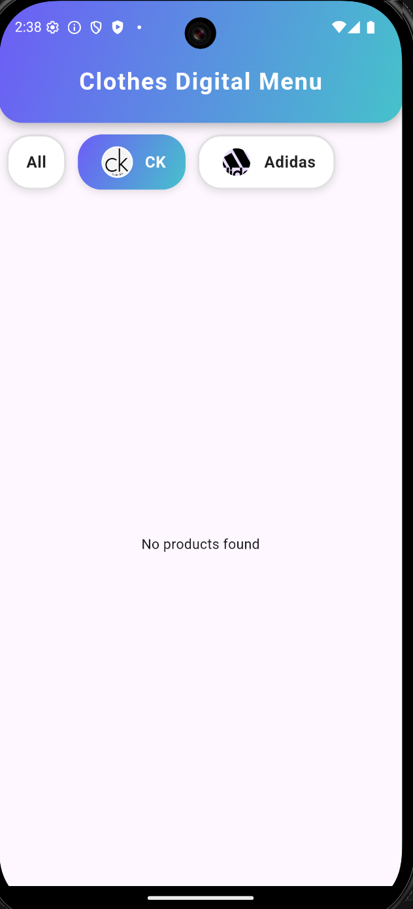

# Clothes Digital Menu

A modern, cross-platform digital menu application for clothing stores, built with Flutter and GetX. This project demonstrates clean architecture, robust state management, and a beautiful, responsive UI.

---

## Table of Contents

- [Overview](#overview)
- [Features](#features)
- [Tech Stack & Packages](#tech-stack--packages)
- [Project Structure](#project-structure)
- [Getting Started](#getting-started)
- [Screenshots](#screenshots)
- [Contributing](#contributing)
- [License](#license)

---

## Overview

**Clothes Digital Menu** is designed to provide a seamless, interactive experience for browsing clothing products and brands. It supports both mobile and desktop platforms, making it ideal for in-store kiosks or customer-facing tablets.

---

## Features

- **Brand & Product Browsing:**  
  View a list of brands and their associated products with rich visuals.

- **Product Details:**  
  See detailed information, images, available sizes, colors, and stock for each product.

- **No Internet Handling:**  
  User-friendly dialogs and retry options when the device is offline.

- **Responsive UI:**  
  Adapts to various screen sizes, from phones to tablets and desktops.

- **Modern Design:**  
  Gradient app bars, animated brand tabs, and stylish product cards.

- **State Management:**  
  Efficient and scalable state management using GetX.

- **Clean Architecture:**  
  Separation of concerns with domain, data, and presentation layers.

---

## Tech Stack & Packages

- **Flutter**  
  The core framework for building cross-platform UIs.

- **GetX**  
  For state management, dependency injection, and navigation.

- **Connectivity Plus**  
  To detect network status and handle offline scenarios.

- **Dart**  
  The programming language for all business logic and UI.

- **Other Notable Packages:**  
  - `get` (GetX)  
  - `connectivity_plus`  
  - (Add any other packages you use, e.g., `http`, `cached_network_image`, etc.)

---

## Project Structure

lib/
  core/           # Core utilities (network, error handling)
  data/           # Data sources, models, repositories
  domain/         # Entities, repositories, use cases
  presentation/   # UI: pages, controllers, widgets, bindings
  main.dart       # App entry point

- **Bindings:**  
  Used for dependency injection and controller lifecycle management.
- **Controllers:**  
  Handle business logic and state for each page.
- **Pages:**  
  UI screens for main menu and product details.
- **Widgets:**  
  Reusable UI components (e.g., dialogs).

## Screenshots

---

## Contributing

Contributions are welcome! Please open issues or submit pull requests for improvements and bug fixes.

---

## License

This project is licensed under the MIT License. See [LICENSE](LICENSE) for details.

---

## Contact

For questions or support, please contact [your.email@example.com](mailto:your.email@example.com).
